# HCD
### Introductie tot de opdracht.
Voor het vak Human Centered Design (HCD) heb ik een product moeten maken waarbij één gebruiker centraal staat. De gebruiker waar ik het product voor heb gemaakt is voor mevrouw Besemer. Mevrouw Besemer heeft al langer dan 35 jaar last van een neurologische ziekte die ervoor heeft gezorgd dat de doorgeef kernen van de zenuwen kapot zijn. Hiervoor kan mevrouw haar vingers niet goed bewegen, wat resulteert in dat mevrouw niet goed gebruik kan maken van websites. Ze maakt gebruik van zowel spraaksoftware (Dragon) als een tekentablet (Wakom). De spraaksoftware gebruikt ze voornamelijk om teksten te typen en de tekentablet voor het navigeren op haar laptop en websites. Voor het product is alleen het gebruik maken van de tekentablet verbeterd, omdat ze daar tegen belangrijke problemen aanliep, zoals het selecteren van tekst. Mevrouw kan haar vingers niet goed bewegen en ze houdt eigenlijk de pen van de tekentablet vast met heel de hand, waardoor het voor haar vrijwel onmogelijk is om de pen te verslepen terwijl ze een knop op de pen ingedrukt houdt. Hierdoor kan zij geen tekst selecteren, wat zij wel erg belangrijk vind. 

De punten waar mevrouw tegenaanloopt staan hieronder concreet beschreven:
- Tekst selecteren is vrijwel niet mogelijk, doordat mevrouw niet kan slepen met de pen terwijl ze een knop ingedrukt houdt.
- Het juiste woord selecteren lukt meestal niet, omdat zij niet met precisie op het eerste letter van een woord kan klikken.
- Tekst kopiëren en plakken is niet mogelijk, omdat zij geen shortcuts op haar toetsenbord kan gebruiken en omdat zij geen rechtermuisklik kan doen.
- Menubalken met dropdowns die on-hover openklappen zijn voor mevrouw onmogelijk om te gebruiken, omdat haar tekentablet clicks doen i.p.v. vegen.
- 

### Functionaliteiten in het prototype
Voor mevrouw heb ik een prototype gemaakt waarin functionaliteiten zijn verwerkt om de problemen waar ze normaal gesproken tegen aanloopt te verhelpen. Dit is een simpele site met de volgende functionaliteiten:
- Menubalk met dropdowns die on-click open klappen. De dropdowns klappen ook open als er met de tab-toets door de site wordt geklikt, wat het mogelijk maakt dat spraaksoftware de dropdowns kan openklappen.
- Voorbeeldtekst waarbij een selectie kan worden gemaakt door op een startpositie en eindpositie te klikken. Dit gaat niet per letter, maar per woord, zodat mevrouw met minder precisie hoeft te klikken.
- Twee knoppen waarmee omhoog en omlaag kan worden 'gescrolled'.
- Andere cursor die zichtbaarder is wanneer de cursor over tekst zweeft. 

### Resultaat van het prototype.
Mevrouw was heel erg tevreden over het prototype, omdat zij prima gebruik kan maken van de extra functionaliteiten. Het lukt haar nu om een selectie van tekst te maken en deze te kopieren en te plakken. Ook vind mevrouw het erg fijn dat ze nu zelf door een pagina kan scrollen a.d.h.v. knoppen. Op één punt na was mevrouw dolgelukkig over het prototype en zou het iets zijn wat ze prima zou kunnen gebruiken. Het punt wat nog wel beter zou kunnen is het tonen dat er een startwoord is aangeklikt om een selectie mee te maken. Voor nu had ik bovenaan de voorbeeld tekst een vakje gemaakt waar staat 'Geselecteerd woord: ' met waarachter het geselecteerde woord. Het probleem hierbij is dat het vakje niet meer zichtbaar is als er naar beneden wordt gescrolled. Hier heb ik wel al twee ideeën voor bedacht, waarvan ik de beste had willen implementeren, mits er meer tijd over was. 

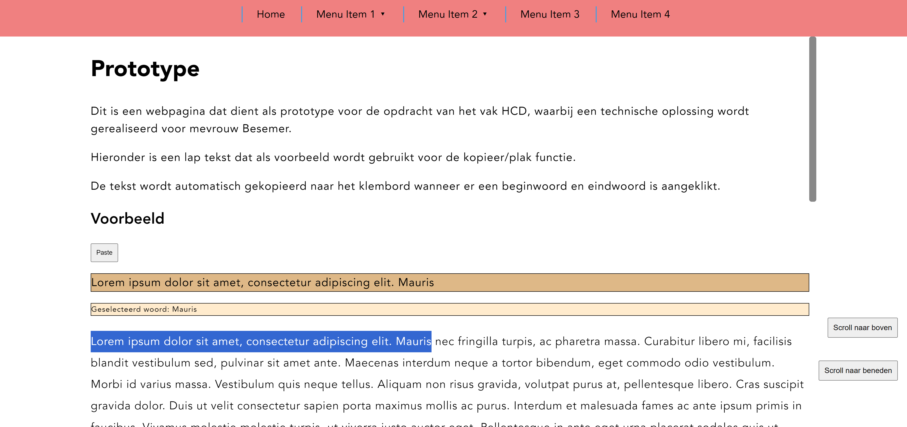

### Wat had ik nog willen implementeren?
Een geselecteerd woord zou ik op twee manieren kunnen weergeven; het woord zelf highlighten door deze bijvoorbeeld dikgedrukt te maken of door een andere achtergrondkleur met omlijning toe te passen op het woord, of door een zwevend vakje te maken dat met de pagina meegaat waarin het geselecteerde woord wordt weergeven. Naar mijn mening, en dat heb ik ook bij andere studenten geöbserveerd, zou het highlighten van een woord de beste oplossing zijn. 

## Design principles
Als reflectie voor de opdracht heb ik gereflecteerd op de toegepaste design principles in het prototype. De design principles in kwetstie zijn:
- Study situation
- Ignore Conventions
- Prioritse Identity
- Add Nonsense

### Study situation
De situatie van mevrouw Besemer is groot en deels al beschreven in de introductie, maar kort gezegd, mevrouw Besemer kan alleen gebruik maken van een tekentablet vanwege haar neurologische ziekte. Ze kan alleen enkele vingers enigzins bewegen, wat het voor haar wel mogelijk maakt om een pen te gebruiken van een tekentablet, maar ze kan geen gebruik maken van een muis of toetsenbord. Spraaksoftware kan ze ook enigzins gebruiken, maar dat vind ze toch niet zo prettig. Hierdoor kan zij websites niet gebruiken zoals zij dat wilt. Zij wilt namelijk vaak stukken tekst die ze interessant vind kopieren, om deze vervolgens naar haar kleinzoon te sturen of te delen op haar Facebook pagina. Ook is het scrollen op websites voor haar erg lastig en heeft ze soms moeite met het gebruik maken van navigatiebalk als deze dropdown menu's bevat die on-hover open klappen.


### Ignore Conventions
Om haar problemen met het gebruik maken van websites op te lossen moeten enkele conventies worden genegeerd. Zo moet er een alternatieve manier worden bedacht voor het scrollen en het selecteren, kopieren en plakken van tekst, wat normaal gesproken prima kan met een muis en/of toetsenbord. Enkele voorbeelden:
- Het gebruik maken van scrollknoppen is in de meeste gevallen onnodig, omdat iemand die gebruik maakt van een muis en/of toetsenbord prima kan scrollen met de pijltjestoetsen of met het scrollwiel van een muis. Voor de meeste mensen zouden de scrollknoppen ook eerder een last zijn, omdat deze in de weg zou kunnen zitten. Maar voor iemand die niks anders kan gebruiken dan een stylus van een tekentablet komt een zichtbare knop op het scherm goed van pas. 
- Het selecteren van tekst kan normaal gesproken met een muis door de linkermuisknop ingedrukt te houden tijdens het slepen van de muis. Maar, omdat mevrouw geen muis kan gebruiken, moet er op een toch soort van omslachtige manier een selectie kunnen worden gemaakt zonder iets te slepen. Naar mijn mening is het aanklikken van een startwoord en een eindwoord de perfecte oplossing, omdat mevrouw simpelweg op de woorden kan klikken en alles wat daar tussenin zit wordt geselecteerd. Het nadeel hiervan is dat als mevrouw perongeluk het verkeerde woord aanklikt, ze met deze methode niet zo snel een nieuwe selectie kan maken als dat iemand dat zou kunnen doen die gebruik maakt van een muis. Toch vind ik zelf dat, ondanks dat dit niet volgens de conventies is, dit een functionaliteit is dat door iedereen gebruikt zou kunnen worden.
- Het kopieren en plakken van tekst ging in het eerste prototype d.m.v. een kopieerknop en een plakknop. De kopieer knop heb ik weggehaald, omdat ik merkte dat het klikken op knoppen mevrouw niet altijd even goed af ging en de selectie verdween als ze naast te knop klikte. Ook adviseerde Vasilis mij om zo min mogelijk knoppen te gebruiken, maar deze alleen te gebruiken waar het echt nodig is, zoals voor het plakken. Het kopieren gaat nu automatisch als mevrouw een selectie heeft gemaakt, wat ook niet volgens de conventies is.
- Normaal gesproken heeft een site geen kopieer en plak knop, maar als een site dit wel heeft zijn deze vaak aan de kleine kant. Het is voor mevrouw Besemer erg lastig om op kleine knoppen te drukken, omdat zij niet heel precies ergens op kan klikken. Om deze reden heb ik de knoppen redelijk groot gemaakt en kunnen deze storend zijn voor een normale gebruiker, omdat het wel wat ruimte in beslag neemt.

### Prioritse Identity
De identiteit van mevrouw Besemer is erg terug te vinden in het prototype, juist omdat de oplossingen voor haar probleem echt geschikt zijn voor iemand die alleen gebruik kan maken van een stylus van een tekentablet. Verder heb ik geen content of styling aan de site toegevoegd die gerelateerd zijn aan mevrouw Besemer, zoals artikelen over dieren die ze mogelijk interessant zou vinden of kleuren waar ze gek op is. Ik heb het prototype echt gelaten als een simpele prototype dat de functionaliteiten waar zij wat aan heeft aan bod brengt. 

### Add Nonsense
Nonsense heb ik naar mijn mening niet echt toegevoegd aan mijn prototypes. Zoals ik in het punt hiervoor benoemde, vond ik de focus op de functionaliteit belangrijker dan de uitstraling van het prototype. Als 'out-of-the-box' idee zou ik het selecteren van de tekst toch wel meenemen als nonsense punt, omdat het best alternatief is om tekst te selecteren met een startwoord en eindwoord. Deze worden op basis van de locatie van de muisklik in de tekst geselecteerd. 


## PROTOTYPES
### 11-04-2024
Vandaag heb ik mijn eerste prototype laten zien aan mevrouw Besemer. Zij was erg tevreden over wat ik tot nu toe al heb gemaakt. De onderdelen die ik heb laten zien waren:

- De navigatiebalk waarmee met een klik een dropdown kan worden geopend i.p.v. met een hover.
- Het selecteren van tekst a.d.h.v. een begin en eindpunt.
- De kopieer en plak knoppen op de hoofdpagina
- Het navigeren naar een andere pagina om daar de tekst te plakken in een tekstveld dat nog bewerkt kan worden a.d.h.v. spraaksoftware.

Ze was erg blij met hoe het selecteren van tekst werkt, omdat het per woord gaat en niet per karakter, wat voor haar onhandig is. Ze kan namelijk niet heel precies klikken. Daarom vond ze de grote knoppen ook fijn. Ook vond zij het lettertype een fijne grootte hebben, het was goed leesbaar. Een ander belangrijk punt was het kopiëren en plakken van tekst, wat ik a.d.h.v. twee knoppen heb gemaakt. Dit vond zij erg prettig werken. De genoemde punten waren naar wens gerealiseerd. 

Het enige wat nog beter zou kunnen is het scrollen; ik heb met mevrouw getest of het voor haar mogelijk was om een slider in een scrollbar te gebruiken a.d.h.v. de tekentablet. Ik ben er hierdoor achtergekomen dat met haar instellingen het slepen van de cursor onmogelijk is, omdat de tekentablet constant klikt i.p.v. dragged. Het was voor haar wel mogelijk om in de scrollbar te klikken, maar dat vind ik zelf geen goede oplossing en dat lijkt me voor mevrouw ook onhandig. Voor het scroll ga ik twee knoppen maken waarmee door de pagina kan worden gescrolled.

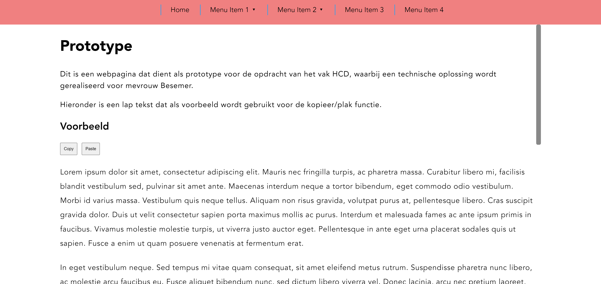

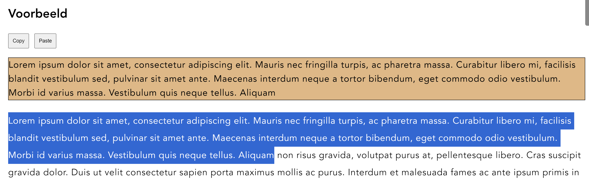

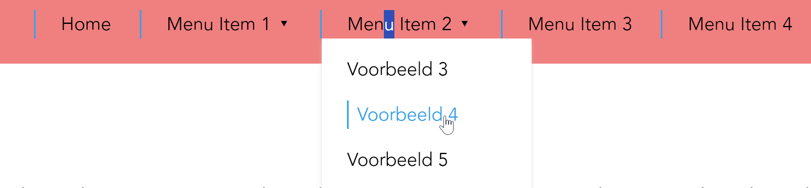

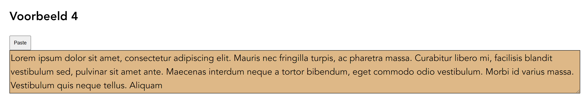

### 17-04-2024
Mevrouw was wederom erg enthousiast over mijn prototype. Omdat het alweer een week geleden was wilde ze graag weer het hele prototype zien, als korte opfrisser. Voor mevrouw heb ik één extra functionaliteit gemaakt, namelijk het scrollen op de pagina a.d.h.v. twee knoppen; één knop om mee naar beneden te scrollen en één knop om mee naar boven te scrollen. Elke knop zal het main element met 200pixels verplaatsen. Het leek mij handiger om dit een vaste waarde te geven, omdat het met een percentage op een hele lange pagina ervoor kan zorgen dat stukken tekst worden overgeslagen. Mevrouw vond dit erg fijn en goed werken, omdat dit precies het geen is waar zij normaal gesproken moeite mee heeft. Maar dit werkt erg goed voor mevrouw.


Wat ik nog verder zou willen implementeren zijn:

- Weergeven van het woord dat als eerste is geselecteerd, omdat mevrouw niet kan aanvoelen of ze wel of niet heeft geklikt. Dit kan a.d.h.v. een highlight (tekst markeren met een kleur) en/of het geselecteerde woord dik en groter maken.
- Animaties voor tijdens het scrollen, om het was smoother te maken.
- Ander cursor icoon wanneer de muis op de tekst staat, om de cursor duidelijker aan te geven.
- Cursor überhaupt groter maken, misschien a.d.h.v. een knop?
- (Optioneel) Facebook of WhatsApp knop dat het geselecteerde tekst direct opent in de desbetreffende site
- (Optioneel) Knop om de tekst te vergroten?
- (Optioneel) Geplakte tekst laten staan en ervoor zorgen dat er meer tekst aan kan worden toegevoegd. Hierbij zou ik dan ook een clear button bij maken, om zo met een schoon tekstvak verder te kunnen gaan.

### 24-04-2024
Ik heb aan mevrouw twee nieuwe 'functies' laten zien; het weergeven van een woord als erop geklikt is en het smooth laten scrollen van de tekst. De functie voor het automatisch kopieren heb ik ook in dit prototype gebruikt, maar dat spreekt voor zich, dat hoeft niet getest te worden, want dat werkt gewoon. Voor het weergeven van een woord heb ik twee verschillende opties. Een woord wordt bovenaan getoond naast 'Geselecteerd woord: ' of een woord wordt in de tekst gehighlight. 

De eerste optie had ik al afgemaakt en ik was benieuwd of mevrouw het fijn vond werken. Zelf was ik er al achtergekomen dat het een onhandige optie is, omdat dit vast bovenaan in de pagina staat en niet zichtbaar is wanneer er naar beneden is gescrolled. Mevrouw was het hier ook mee eens. Vervolgens liet ik mevrouw de andere optie zien, die ik helaas nog niet af had en dat is het highlighten van de tekst. Mevrouw vond dit erg duidelijk en zou liever deze optie willen gebruiken. 

Tenslotte liet ik mevrouw het smooth scrollen van de scroll knoppen zien en die vond ze erg fijn. Ze vond het beter dan dat de tekst plots naar beneden schuift, omdat de tekst nu met een animatie naar beneden wordt geschoven en mevrouw kan volgen waar ze nog was in de tekst. Aangezien dit de laatste test was, gaf mevrouw ook de opmerking dat als ze me had mogen beoordelen, ze me een hoog cijfer zou geven. Dat was natuurlijk erg leuk om te horen.

## FEEDBACKGESPREKKEN
### 12-04-2024 (Eric)
Vandaag had ik een gesprek met Eric over het prototype dat ik heb gemaakt voor mevrouw Besemer. Hij was erg positief over het prototype dat ik heb gemaakt en we hebben samen nagedacht over wat de perfecte oplossing zou zijn voor mevrouw Besemer, namelijk het maken van een browser extentie. De nadruk ligt hierbij dat het de perfecte oplossing ZOU kunnen zijn, aangezien het onrealistisch is voor mij om binnen twee weken een browser extentie te maken. Toch zou het een goed punt zijn om te benoemen tijdens het eindgesprek, zodat ik kan aantonen dat ik heb nagedacht over wat een betere oplossing zou zijn dan wat ik heb gemaakt. 

Voor nu gaf Eric mij twee punten mee waar ik aan zou kunnen werken, namelijk scrollknoppen maken om door de pagina heen te scrollen en het mogelijk maken dat de gekopieerde tekst tussen teksten geplakt zou kunnen worden, voor als mevrouw een verhaal zou willen schrijven voor op bijvoorbeeld Facebook, bestaande uit meerdere geplakte stukken tekst of uit geschreven tekst waar een gekopieerd stuk tekst aan zou kunnen worden geplakt.

### 19-04-2024 (Vasilis)
Vasilis:

- Begin selectie aangeven
- Kopieren gelijk na het maken van de selectie i.p.v. op een knop drukken
- Scroll animaties
- Kijken of ik een script kan toevoegen aan de site van Gemeente Amsterdam om menu items onclick te openen i.p.v. onhover, ter demonstratie (Greasemonkey)

Ignore Conventions:

- Gewoon kopieren, plakken en scrollen werken niet, dus iets maken dat zich niet houdt aan de conventies

## LOGS
### 09-04-2024
Om te beginnen heb ik het concept uitgewerkt waarvan ik een eerste prototype heb gemaakt. Voor nu bestaat het prototype uit een basic layout met wat opvultekst waarop een eventlistener luistert naar clicks in het opvultekst. De functie die hierbij hoort is het selecteren van tekst op basis van een start en einde click, waardoor gemakkelijk tekst kan worden geselecteerd. 

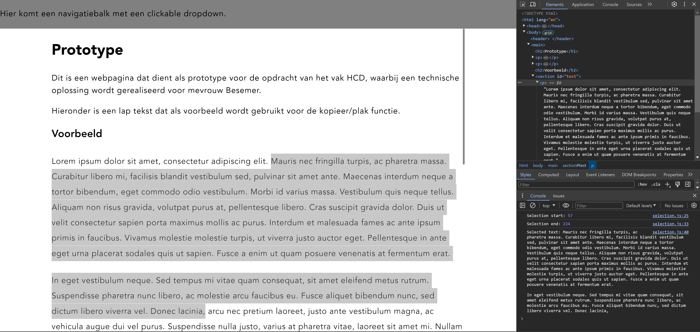

De site werkt ook op de mobile view waarbij gebruikt wordt gemaakt van touch clicks en niet muis clicks

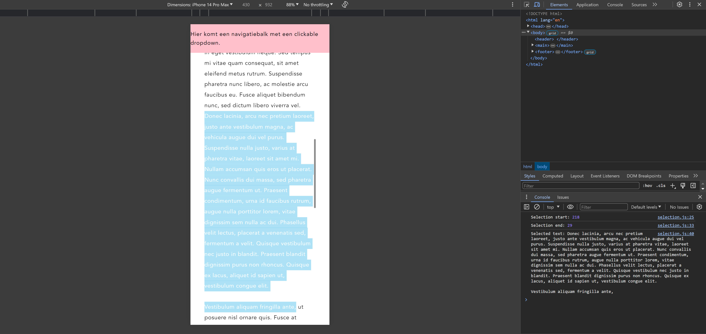

Het script dat hierbij hoort ziet er als volgt uit:

```jsx
// Default value to track if selecting is in progress
let isSelecting = false;
// Variables to store start and end nodes and offsets of selection
let selectionStartNode, selectionEndNode, selectionStartOffset, selectionEndOffset;
// Element representing the section on the page that should be selectable
const sectionToSelect = document.getElementById('test');

// Event listener for click events within the section
sectionToSelect.addEventListener('click', function(event) {
    // Determine the clicked target element
    const target = event.target;
    // Check if the clicked element is a paragraph
    if (target.nodeName === 'P') {
        // Store the clicked paragraph
        const paragraph = target;
        // Retrieve the whole word of the selected position
        const { node: startNode, offset: startOffset } = getWordAtPosition(paragraph, event.clientX, event.clientY);
        // If not in the middle of a selection
        if (!isSelecting) {
            // Store start position and indicate selection start
            selectionStartNode = startNode;
            selectionStartOffset = startOffset;
            isSelecting = true;
            // Log the start position
            console.log('Selection start:', selectionStartOffset);
        // If in the middle of a selection (second click)
        } else {
            // Store end position and indicate selection end
            selectionEndNode = startNode;
            selectionEndOffset = startOffset;
            isSelecting = false;
            // Log the end position
            console.log('Selection end:', selectionEndOffset);
            // If both start and end positions are defined
            if (selectionStartNode && selectionEndNode) {
                // Select the text between start and end positions
                selectText(selectionStartNode, selectionStartOffset, selectionEndNode, selectionEndOffset);
                // Get the selected text as a string and log it
                const selectedText = window.getSelection().toString();
                console.log('Selected text:', selectedText);
            }
        }
    }
});

// Function to retrieve the word at a clicked position within a paragraph
function getWordAtPosition(paragraph, x, y) {
    // Create a range to work with
    const range = document.createRange();
    // Retrieve the text node representing the paragraph content
    let textNode = paragraph.firstChild;
    // Iterate through the paragraph's text nodes
    while (textNode) {
        range.selectNodeContents(textNode);
        // Check if the clicked position is within the current text node
        const rects = range.getClientRects();
        for (let i = 0; i < rects.length; i++) {
            const rect = rects[i];
            if (y >= rect.top && y <= rect.bottom) {
                // Calculate the word boundaries based on click position
                const offset = document.caretRangeFromPoint(x, y).startOffset;
                let wordStart = offset;
                let wordEnd = offset;
                // Move wordStart to the start of the word
                while (wordStart > 0 && /\S/.test(textNode.textContent.charAt(wordStart - 1))) {
                    wordStart--;
                }
                // Move wordEnd to the end of the word
                while (wordEnd < textNode.length && /\S/.test(textNode.textContent.charAt(wordEnd))) {
                    wordEnd++;
                }
                // Return the node and offset representing the clicked word
                return { node: textNode, offset: wordStart };
            }
        }
        // Move to the next text node within the paragraph
        textNode = textNode.nextSibling;
    }

    // If no word found, return the first node and offset
    return { node: paragraph.firstChild, offset: 0 };
}

// Function to select text from start to end position, including the next word
function selectText(startNode, startOffset, endNode, endOffset) {
    const selection = window.getSelection();
    const range = document.createRange();
    
    // Set the start of the range
    range.setStart(startNode, startOffset);
    
    // Calculate the end offset to include the next word
    let nextWordEndOffset = endNode.textContent.indexOf(' ', endOffset);
    if (nextWordEndOffset === -1) {
        nextWordEndOffset = endNode.textContent.length;
    }
    
    // Set the end of the range to include the next word
    range.setEnd(endNode, nextWordEndOffset);

    // Clear existing selection and add the new range
    selection.removeAllRanges();
    selection.addRange(range);
}
```

Het script bestaat uit drie onderdelen; de eventlistener, een functie voor het verkrijgen van een geheel woord op de locatie van een click en het maken van een selectie met een begin en eind locatie. Beide functies worden in de eventlistener uitgevoerd. De eventlistener is luistert naar algemene clicks in het stuk voorbeeld tekst en op basis van een vooraf ingestelde variabele wordt het soort click bepaald. Voor de eerste click is de variabele false, na de eerste click true en na de tweede click weer false. Als er weer een click plaats vind, zal de variabele weer true worden en begint de selectie opnieuw. 

De functie voor het verkrijgen van een geheel woord op de locatie van een click werkt als volgt; 

Eerst wordt de paragraaf van de click verkegen, vanuit waar er door de ‘text nodes’ van de paragraaf wordt gelooped. Per paragraaf is over het algemeen één text node, maar dit kunnen er altijd meer zijn. Er wordt gecontroleerd of de geklikte positie in de huidige text node voorkomt, wat altijd true zal zijn. Vervolgens wordt er gekeken naar de ‘word boundaries’ van de geklikte locatie, wat als het ware het start en eind locatie van het woord verkrijgt. De waardes worden in apart van elkaar in variabelen geplaatst, vanuit waar het gehele woord wordt verkregen. Als er nog een text node is, zal de loop hetzelfde doen voor de volgende text node.

Teruggaand naar de event listener is te zien dat aan de functie dat hierboven omschreven is de waardes ‘startNode’ en ‘startOffset’ worden teruggegeven door de functie, die gebruikt worden om de paragraaf en start locatie op te slaan in een variabele dat in de eventlistener staat, zodat deze verder gebruikt kunnen worden.

De functie voor het selecteren van een begin en eind positie werkt als volgt;

Eerst wordt er een nieuwe document range aangemaakt, waaraan eerst de paragraaf van de 1e click en de start locatie in de paragraaf worden toegevoegd. Vervolgens zal dit ook gebeuren de paragraaf van de 2e click en de eind locatie in de paragraaf. Echter wordt hieraan nog een extra woord toegevoegd, namelijk het woord waarop is geklikt. De functie zal zonder deze toevoeging een selectie maken van het start woord en het woord voor het eind woord, wat niet de bedoeling is. Tenslotte zal de range worden ingesteld en zal dit in de eventlistener gebruikt worden om eenmaal een selectie te maken dat gekopieerd kan worden.

### 10-04-2024
Vandaag heb ik de functie voor het kopieren en plakken van tekst geïmplementeerd. Dit werkt a.d.h.v. twee knoppen; één voor het kopieren van een selectie en één voor het plakken van tekst in een van te voren aangewezen plek. 

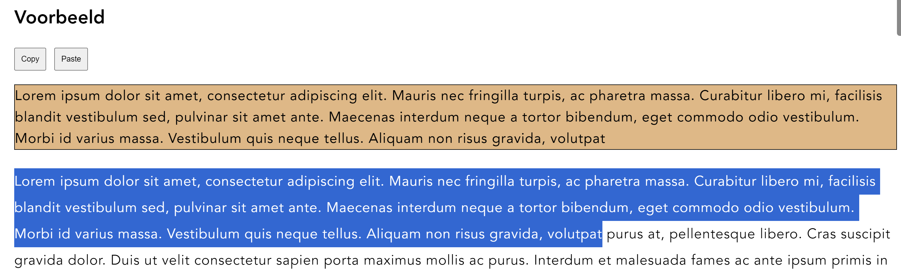

Verder heb ik een navigatiebalk gemaakt met daarin twee dropdown menu’s die geopend kunnen worden door op de bijbehorende knop in de navigatiebalk te drukken. Ik heb de navigatiebalk toegevoegd, omdat ik vorige week oppikte dat mevrouw het niet fijn vond dat de website van de Gemeente Amsterdam een navigatiebalk had dat werkt op hover i.p.v. click. Zij kan alleen gebruik maken van clicks en niet van hover, dus om deze reden heb ik een navigatiebalk gemaakt dat werkt op basis van clicks om een dropdown menu te openen.

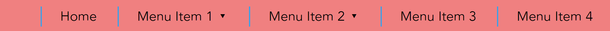

Tenslotte heb ik extra pagina’s toegevoegd als voorbeeld pagina’s. Dit zijn allemaal dezelfde pagina’s waarin een tekstveld te zien is met een plak knop daarboven. Het idee hierachter is dat mevrouw de tekst kan plakken en a.d.h.v. de spraaksoftware extra tekst kan toevoegen, zoals een kort berichtje. Het tekstveld kan ook worden beschouwd als een test functionaliteit om te laten zien dat de tekst ook op andere pagina’s kan worden geplakt. Het tekstveld schaalt mee met de inhoud.

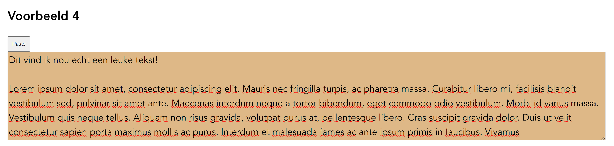

### 16-04-2024
Vandaag heb ik twee functies gemaakt die ervoor zorgen dat het main element 200px omhoog/omlaag wordt verplaatst. De functies worden a.d.h.v. de bijbehorende buttons uitgevoerd. De functies zien er als volgt uit:

```jsx
function scrollUp() {
    const mainElement = document.querySelector('main');
    mainElement.scrollTop -= 200;
}

function scrollDown() {
    const mainElement = document.querySelector('main');
    mainElement.scrollTop += 200;
}
```

De knoppen zien er als volgt uit:
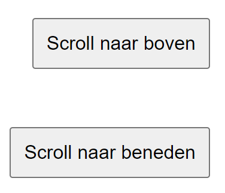

### 23-04-2024
Vandaag heb ik een aantal functies van de site aangepast, namelijk:
- Bij het selecteren van een woord zal het geselecteerde woord worden weergegeven boven de gehele tekst, om zo aan te duiden dat een woord is geselecteerd.
- Als de muis op de tekst staat, veranderd de cursor van het default hover cursor naar een meer opvallende cursor.
- Als de scroll knoppen worden gebruikt zal er een animatie worden afgespeeld, zodat het net lijkt alsof er naar beneden wordt gescrolled i.p.v. dat de tekst 200px omlaag verspringt.
- De gehele navigatiebalk is tabbable, inclusief de dropdown.
- Als er een selectie is gemaakt, zal deze gelijk worden gekopieerd i.p.v. dat er nog op een knop moet worden gedrukt om de selectie te kopieren. 

Op basis van het verkregen feedback van mevrouw Besemer en Vasilis heb ik de functionaliteit voor het zichtbaarmaken van een geselecteerd woord toegevoegd. Mevrouw Besemer vond het bij het testen van het prototype lastig om te zien of ze nou wel of niet een woord had geselecteerd. Vasilis gaf eigenlijk dezelfde feedback aan mij terug tijdens het afgelopen feedback gesprek, evenals Eric bij het feedback gesprek dat weer daarvoor had plaatst gevonden. Om deze reden heb ik nagedacht om een geselecteerd woord zichtbaar te maken. 

Het volgende stuk script is toegevoegd aan de functie 'getWordAtPosition' in selection.js.
```jsx
const selectedText = textNode.textContent.substring(wordStart, wordEnd);

const parent = document.querySelector('#selectedWord')
const existingSpan = document.querySelector('#pastedWord')
if (existingSpan) {
    parent.removeChild(existingSpan)
}
                
const span = document.createElement('span');
span.setAttribute('id', 'pastedWord')
span.textContent = selectedText
                
// const referenceNode = parent.firstChild
parent.appendChild(span)
```

Het volgende stuk css code is toegevoegd aan style.css.
```css
#selectedWord span {
    font-family: var(--text);
    letter-spacing: 0.8px; 
}

#selectedWord span:nth-of-type(2) {
    background-color: darkorange;
    border: 1px solid black;
    padding: 5px;
}
```

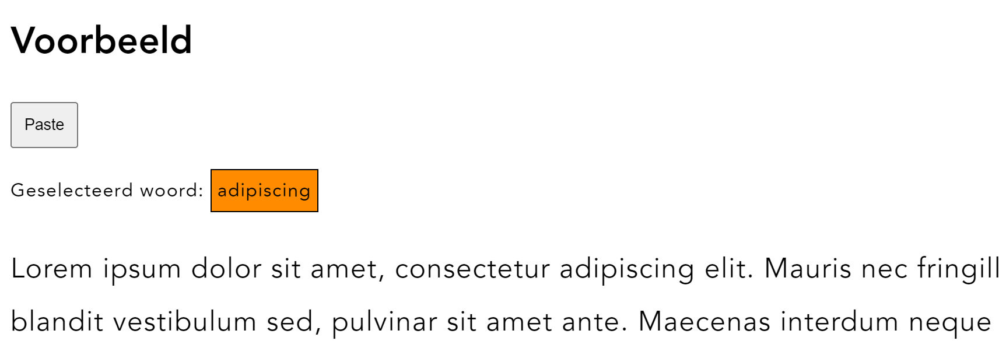

Hetzelfde geldt eigenlijk voor de zichtbaarheid van de cursor wanneer deze op de tekst staat. Standaard is dit een 'staafje' die erg dun is en dezelfde kleur heeft als de tekst, wat het voor mevrouw Besemer onmogelijk maakt om deze te zien. Ik heb er voor gekozen om cursor te gebruiken dat meer opvalt, eentje die groter is en niet dezelfde kleur heeft als de tekst. 

```css
#test:hover {
    cursor:grab;
}
```

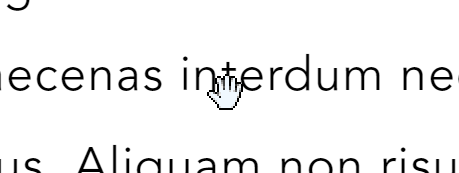

Vasilis had als feedback punt gegeven dat ik beter een animatie kon gebruiken voor de scroll knoppen, omdat het er een beetje gekkig uitziet dat de tekst gelijk 200px verspringt. Hiervoor heb ik een animatie gemaakt dat de scroll-behaviour veranderd naar smooth. De animatie duurt .5 seconden. Het omhoog en omlaag laten gaan van de tekst wordt nog wel door JavaScript geregeld. Ook heb ik toegevoegd dat er tijdens de scroll animatie geen clicks kunnen plaats vinden, om complicaties met de animatie te voorkomen.

De functie voor de scroll knoppen ziet er nu als volgt uit.

```jsx
function scrollUp() {
  const mainElement = document.querySelector('main');
  const bodyElement = document.querySelector('body')
  
  // Add a class to main element to trigger the scroll up animation
  mainElement.classList.add('animating', 'scroll-up');
  bodyElement.classList.add('animating')
  
  // Scroll up after a short delay to allow animation to start
  setTimeout(() => {
      mainElement.scrollTop -= 200; // Scroll up by 200px
  }, 50); // Adjust the delay as needed
  
  // Remove the animation class after animation completes
  setTimeout(() => {
      mainElement.classList.remove('animating', 'scroll-up');
      bodyElement.classList.remove('animating')
  }, 500); // Adjust the delay to match the animation duration
}

function scrollDown() {
  const mainElement = document.querySelector('main');
  const bodyElement = document.querySelector('body')
  
  // Add a class to main element to trigger the scroll down animation
  mainElement.classList.add('animating', 'scroll-down');
  bodyElement.classList.add('animating')
  
  // Scroll down after a short delay to allow animation to start
  setTimeout(() => {
      mainElement.scrollTop += 200; // Scroll down by 200px
  }, 50); // Adjust the delay as needed
  
  // Remove the animation class after animation completes
  setTimeout(() => {
      mainElement.classList.remove('animating', 'scroll-down');
      bodyElement.classList.remove('animating')
  }, 500); // Adjust the delay to match the animation duration
}
```

```css
/* Define the scroll up animation */
@keyframes scrollUpAnimation {
    from {
        scroll-behavior: smooth;
    }
    to {
        scroll-behavior: smooth;
    }
}

/* Define the scroll down animation */
@keyframes scrollDownAnimation {
    from {
        scroll-behavior: smooth;
    }
    to {
        scroll-behavior: smooth;
    }
}

/* Apply the animation to the main element during scrolling up */
main.animating.scroll-up {
    animation: scrollUpAnimation 0.5s ease forwards;
}

/* Apply the animation to the main element during scrolling down */
main.animating.scroll-down {
    animation: scrollDownAnimation 0.5s ease forwards;
}

/* Disable pointer events during animation to prevent user interaction */
main.animating {
    pointer-events: none;
}

body.animating {
    pointer-events: none
}
```

Om de toegankelijkheid van de site te verhogen heb ik ervoor gekozen om de gehele navigatiebalk tabbable te maken, zodat mevrouw Besemer daar gebruik van kan maken. Met de navigatiebalk die ik oorspronkelijk had kon er wel doorheen worden getabbed, maar niet door de navigatie items die een dropdown menu bevatten. Ik heb kleine aanpassingen verricht aan de navigatiebalk om de items die een dropdown menu bevatten toch tabbable te maken.

Het volgende stuk script is toegevoegd aan dropdown.js en zorgt er als het ware voor dat als het navigatie item met de dropdown menu in focus is, de functie voor het openklappen van het dropdown menu wordt uitgevoerd. De const die eronder staat zorgt ervoor dat er tijdens het tabben na het laatste menu item, het dropdown menu wordt gesloten en het tabben verder gaat in de navigatiebalk of de volgende dropdown menu. Aan de dropdown menu's heb ik een tabindex toegevoegd, zodat deze worden meegenomen tijdens het tabben.

```jsx
// Listen for focus event on li items
const dropdownItems = document.querySelectorAll('.menuItemButton');
dropdownItems.forEach(item => {
    item.addEventListener('focus', (event) => {
        const attribute = event.target.attributes[1].value.toString();
        const character = attribute.charAt(14);
        openMenuItem(character);
    });
});

// Listen for keydown event on the last item of the dropdown menu
const dropdownMenus = document.querySelectorAll('.dropdown');
dropdownMenus.forEach(menu => {
    const menuItems = menu.querySelectorAll('li');
    const lastMenuItem = menuItems[menuItems.length - 1];
    lastMenuItem.addEventListener('keydown', (event) => {
        if (event.key === 'Tab' && !event.shiftKey) {
            closeMenu();
        }
    });
});
```

```html
<nav role="navigation" class="primary-navigation">
    <ul>
        <li><a href="/">Home</a></li>
        <li tabindex="0" onclick="openMenuItem('1')" class="menuItemButton"><a>Menu Item 1 &dtrif;</a>
            <ul id="menuItem1" class="dropdown">
                <li><a href="./example-1.html">Voorbeeld 1</a></li>
                <li><a href="./example-2.html">Voorbeeld 2</a></li>
            </ul>
        </li>
        <li tabindex="0" onclick="openMenuItem('2')" class="menuItemButton"><a>Menu Item 2 &dtrif;</a>
            <ul id="menuItem2" class="dropdown">
                <li><a href="./example-3.html">Voorbeeld 3</a></li>
                <li><a href="./example-4.html">Voorbeeld 4</a></li>
                <li><a href="./example-5.html">Voorbeeld 5</a></li>
            </ul>
        </li>
        <li><a href="/">Menu Item 3</a></li>
        <li><a href="/">Menu Item 4</a></li>
    </ul>    
</nav>
```

Tenslotte heb ik op basis van de meest recente test met mevrouw Besemer en feedback van Vasilis ervoor gekozen om een selectie direct naar het klembord te kopieren i.p.v. dat er op een knop moet worden gedrukt om de selectie te kopieren. Ik merkte bij de meest recente test met mevrouw Besemer dat ze nog wel eens misklikt, wat ervoor zorgt dat de selectie verdwijnt. Nou had ik ook een functie kunnen toevoegen dat de selectie zou blijven staan, maar dat zorgt ervoor dat mevrouw niet opnieuw kan beginnen met de selectie wanneer zij bijvoorbeeld de verkeerde woorden heeft geselecteerd. Het leek Vasilis zelf handiger als de selectie direct naar het klembord zou worden gekopieerd, omdat je eigenlijk zo min mogelijk acties wilt uitvoeren op een site om een bepaald resultaat te bereiken.

Het volgende stuk JavaScript is toegevoegd aan de functie 'selectText' in selection.js
```jsx
    navigator.clipboard.writeText(selection).then(function() {
        console.log('Copy was succesful!')
    }, function(err) {
        console.error('An error has occured: ' + err)
    })
```

